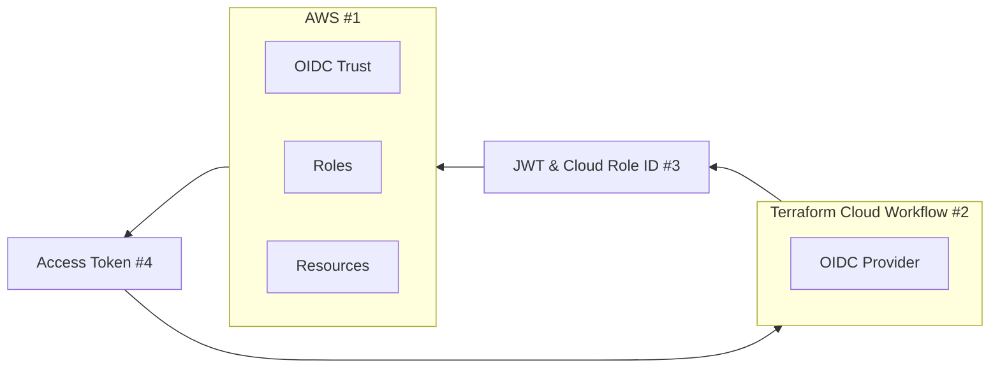

Following this article will get you setup with an AWS Root account that can be
managed through through Terraform Cloud with OIDC and github actions. As a best practice you
should not keep long-lived access keys in your CI/CD pipelines when
deploying to AWS, instead you should use OIDC (OpenID Connect) to securely
deploy to AWS when using Terraform Cloud or Github Actions.

# TL;DR
Download all the terraform from the blog post here:

* [https://github.com/sontek/aws-apply-before-merge](https://github.com/sontek/aws-apply-before-merge)
* [https://github.com/sontek/aws-terraform-github-actions](https://github.com/sontek/aws-terraform-github-actions)

# How does OIDC work
OIDC enables us to request a short-lived access token directly from AWS. We
just have to create trust relationship that controls which workflows are able
to request the access tokens.

- No need to duplicate AWS credentials as long-lived GitHub secrets.
- Since we are using a short-lived access token that is only valid for a single
  job there is no reason to worry about rotating secrets.

The following diagram gives an overview of how we can use Terraform Cloud's
OIDC provider to integrate with AWS:



1. In AWS, create an OIDC trust between a role and our terraform cloud
   workflow(s) that need access to the cloud.
2. Every time a job runs, TFC's OIDC Provider auto-generates an OIDC token.
   This token contains multiple claims to establish a security-hardened and
   verifiable identity about the specific workflow that is trying to authenticate.
3. Request this token from TFC's OIDC provider, and present it to AWS
4. Once AWS successfully validates the claims presented in the token, it then
   provides a short-lived cloud access token that is available only for the duration
   of the job.

# What does this post accomplish
- Setup a root AWS account that is managed througuh terraform
- Setup OIDC authentication with Terraform Cloud so it can talk to AWS
- Setup Github Actions authentication with Terraform Cloud so we can run plan
  and apply through the CI/CD pipeline.

# Setup AWS Access
It is very bad practice to use the root account for much of anything but for
bootstrapping the account it is necessary, so the first step is to get your
`AWS_ACCESS_KEY_ID` and `AWS_SECRET_ACCESS_KEY`

To do this click your account and choose `Security Credentials` in the top
right:

<center>

</center>

Then choose `Create Access key`:

<center>

</center>

You need to set these environment variables in your shell so that your local
shell has access to AWS. After you set them you can verify you set them correct
by running:

```bash
❯ aws sts get-caller-identity
```

and you should get a result similar to:

```json
{
    "UserId": "777777777777",
    "Account": "888888888888",
    "Arn": "arn:aws:iam::888888888888:root"
}
```

## Bootstrap
Before you can manage any of your accounts through Terraform Cloud you'll need
bootstrap some core infrastructure like OIDC so Terraform Cloud can authenticate
securely and manage AWS Resources on your behalf.

I personally prefer doing this in two repositories:

- `infra-bootstrap`: This repository does the bare minimum to hook up terraform
   cloud with your AWS account and stores the state in git.  Its the only infra
   that will not be controlled by your CI/CD pipeline.ccccccug

- `infra`: The actual repository where all the rest of your AWS resources are
   managed.  It will store state in Terraform Cloud and you can introduce a
   CI/CD pipeline for approving changes.

   **Note**: This repository will be generated with the terraform code.

After manually creating the git repository `infra-boostrap` in your Github
account We will need 3 providers to bootstrap the account `aws`, `github`, and
`tfe`.

### Variables
Create a `1-variables.tf` where we can define the variables we'll need
   for creating these resources.

```hcl
variable "tfc_aws_audience" {
  type        = string
  default     = "aws.workload.identity"
  description = "The audience value to use in run identity tokens"
}

variable "tfc_hostname" {
  type        = string
  default     = "app.terraform.io"
  description = "The hostname of the TFC or TFE instance you'd like to use with AWS"
}

variable "tfc_project_name" {
  type        = string
  default     = "Default Project"
  description = "The project under which a workspace will be created"
}

variable "tfc_organization_name" {
  type        = string
  description = "The name of your Terraform Cloud organization"
}

variable "tfc_organization_owner" {
  type        = string
  description = "The owner of the TFC organization"
}

variable "tfc_workspaces" {
  type        = list(string)
  description = "The list of TFC workspaces"
}

variable "github_organization" {
  description = "The organization the repositories are owned by"
  type        = string
}

variable "github_repo_name" {
  description = "The name of the git reppository we'll create for managing infra"
  type        = string
}

variable "github_default_branch" {
  description = "The default branch to utilize"
  type        = string
  default     = "main"
}

variable "aws_root_account_id" {
  description = "The AWS root account we want to apply these changes to"
  type        = string
}
```

We will use these variables in the later modules but they are mostly metadata
around the terraform and github accounts you'll need to setup manually.

### Providers
Create a file called `2-providers.tf` and define the providers:

```hcl
terraform {
  required_providers {
    tfe = {
      source  = "hashicorp/tfe"
      version = "0.41.0"
    }

    aws = {
      source  = "hashicorp/aws"
      version = "4.58.0"
    }

    github = {
      source  = "integrations/github"
      version = "5.18.3"
    }
  }
}

provider "aws" {
  region = "us-east-1"

  # Root account, all other accounts should be provisioned
  # via pull requests
  allowed_account_ids = [var.aws_root_account_id]
}

provider "github" {
  owner = var.github_organization
}
```

The key things there are we define `allowed_account_ids` to prevent us from
working against any account that isn't the root and we are using one of the
variables we defines earlier.

### Github
We will utilize `terraform` to create the second git repository where the rest
of the infrastructure will go. Create a file called `3-github.tf`:

```hcl
resource "github_repository" "repo" {
  name        = var.github_repo_name
  description = "Infrastructure Repository"
  visibility  = "private"
  auto_init   = true
  has_issues  = true
}

resource "github_branch_default" "default" {
  repository = github_repository.repo.name
  branch     = var.github_default_branch
}

data "tfe_team" "owners" {
  name         = "owners"
  organization = tfe_organization.organization.name
}

resource "tfe_team_token" "github_actions_token" {
  team_id = data.tfe_team.owners.id
}

resource "github_actions_secret" "tfe_secret" {
  repository      = github_repository.repo.name
  secret_name     = "TFE_TOKEN"
  plaintext_value = tfe_team_token.github_actions_token.token
}

output "repository_id" {
  value = github_repository.repo.id
}
```

This will generate a new repository in your account called `infra`.

For the terraform provider to have access to github you need to create a new
personal access token with full `repo` access and set it as an environment
variable named `GITHUB_TOKEN`.


### Terraform Cloud
Now we need to setup dynamic credentials so the terraform cloud agent is
allowed to take actions on your behalf.   To do this we'll setup an IAM
role and an OIDC provider. Create a file called `4-tfc.tf`:

```hcl
resource "tfe_organization" "organization" {
  name  = var.tfc_organization_name
  email = var.tfc_organization_owner
}

/* AWS will use this TLS certificate to verify that requests for dynamic
credentials come from Terraform Cloud.*/
data "tls_certificate" "tfc_certificate" {
  url = "https://${var.tfc_hostname}"
}

/* sets up an OIDC provider in AWS with Terraform Cloud's TLS certificate,
the SHA1 fingerprint from the TLS certificate
*/
resource "aws_iam_openid_connect_provider" "tfc_provider" {
  url            = data.tls_certificate.tfc_certificate.url
  client_id_list = [var.tfc_aws_audience]
  thumbprint_list = [
    data.tls_certificate.tfc_certificate.certificates[0].sha1_fingerprint
  ]
}

/* Policy to allow TFC to assume the AWS IAM role in our account */
data "aws_iam_policy_document" "assume_role" {
  statement {
    effect = "Allow"

    principals {
      type        = "Federated"
      identifiers = [aws_iam_openid_connect_provider.tfc_provider.arn]
    }
    condition {
      test     = "StringEquals"
      variable = "${var.tfc_hostname}:aud"

      values = [
        "${one(aws_iam_openid_connect_provider.tfc_provider.client_id_list)}"
      ]
    }

    condition {
      test     = "StringLike"
      variable = "${var.tfc_hostname}:sub"

      values = [
        for workspace in var.tfc_workspaces : "organization:${tfe_organization.organization.name}:project:${var.tfc_project_name}:workspace:${workspace}:run_phase:*"
      ]
    }
    actions = ["sts:AssumeRoleWithWebIdentity"]
  }
}

resource "aws_iam_role" "tfc-agent" {
  name               = "tfc-agent"
  assume_role_policy = data.aws_iam_policy_document.assume_role.json
}

/* Policy for what the TFC agent is allowed to do */
data "aws_iam_policy_document" "tfc-agent" {
  version = "2012-10-17"

  statement {
    actions   = ["*"]
    effect    = "Allow"
    resources = ["*"]
  }
}

resource "aws_iam_policy" "tfc-agent" {
  name        = "tfc-agent-access-policy"
  description = "Access policy for the TFC agent"
  policy      = data.aws_iam_policy_document.tfc-agent.json
}

resource "aws_iam_role_policy_attachment" "tfc-access-attach" {
  role       = aws_iam_role.tfc-agent.name
  policy_arn = aws_iam_policy.tfc-agent.arn
}

resource "tfe_workspace" "workspaces" {
  count        = length(var.tfc_workspaces)
  name         = var.tfc_workspaces[count.index]
  organization = tfe_organization.organization.name

  working_directory = var.tfc_workspaces[count.index]
}

/* These variables tell the agent to use dynamic credentials */
resource "tfe_variable" "tfc-auth" {
  count        = length(var.tfc_workspaces)
  key          = "TFC_AWS_PROVIDER_AUTH"
  value        = true
  category     = "env"
  workspace_id = tfe_workspace.workspaces[count.index].id
  description  = "Enable dynamic auth on the TFC agents"
}

resource "tfe_variable" "tfc-role" {
  count        = length(var.tfc_workspaces)
  key          = "TFC_AWS_RUN_ROLE_ARN"
  value        = aws_iam_role.tfc-agent.arn
  category     = "env"
  workspace_id = tfe_workspace.workspaces[count.index].id
  description  = "Tell TFC what Role to run as"
}
```

This module is dynamic because there is one piece that will require a
manual oauth setup for github.  So the first pass will apply without it
and then later on we'll create it and run the apply again.

## Applying the changes
Now we just need to define our settings for the module and we'll get our
infrastructure applied.  Create a file called `settings.auto.tfvars` and
populate it with the content for your account.  This is an example of what
this should look like:

```hcl
tfc_organization_name  = "sontek"
tfc_organization_owner = "john@sontek.net"

# The workspaces you want to create and be able to manage with IaC
tfc_workspaces = [
  "root"
]
# this can be your username
github_organization    = "sontek"
github_repo_name       = "sontek-infra"
aws_root_account_id    =  "888888888888"
```

Now run:

```bash
❯ terraform login
❯ terraform init
```

and you should see:

```
Terraform has been successfully initialized!
```

Now lets run our plan:

```
❯ terraform plan
```

You should see a result:

```
Plan: 10 to add, 0 to change, 0 to destroy.
```

Apply it to make those resources:

```
❯ terraform apply
```

At this point it:

1. Created a terraform cloud organization
2. Created a terraform cloud workspace
3. Created a git repository

# Verify TFC can talk to AWS
To verify that TFC can communicate with AWS through the dynamic credentials,
lets clone the *NEW* repository we just generated and make some dummy resources. After
you've cloned the repository lets make a folder for the workspace `root` that we
defined in bootstrap:

```bash
❯ mkdir root
❯ cd root
```

Now create a `1-providers.tf`:

```hcl
terraform {
  cloud {
    organization = "sontek"

    workspaces {
      name = "root"
    }
  }

  required_providers {
    aws = {
      source  = "hashicorp/aws"
      version = "4.58.0"
    }

    tfe = {
      source  = "hashicorp/tfe"
      version = "0.42.0"
    }
  }
}

provider "aws" {
  region = "us-east-1"

  default_tags {
    tags = {
      Owner   = "john@sontek.net"
      Env     = "Root"
      Service = "BusinessOperations"
    }
  }
}
```
**NOTE**: You should replace `organization`, `workspaces.name`, and
`tags.Owner` to be your own values.

Now create a small resource to prove everything is working, we'll use SQS for
this. Create a file called `2-sqs.tf`:

```hcl
resource "aws_sqs_queue" "example-sqs" {
  name                        = "example-sqs"
  message_retention_seconds = 86400
  receive_wait_time_seconds = 10
}
```

If you run the plan you should see the resource it wants to create:

```bash
❯ terraform init
❯ terraform plan

```

and you should see the run is executing in terraform cloud:

```
Running plan in Terraform Cloud. Output will stream here. Pressing Ctrl-C
will stop streaming the logs, but will not stop the plan running remotely.
```

You can click the link it provides to see the logs. Now lets apply this
resource to see it all working:

```
❯ terraform apply
```

You should get a response like:

```
Apply complete! Resources: 1 added, 0 changed, 0 destroyed.
```

So Terraform Cloud has full access to create AWS resources!   The final step
is to get github running the plan/apply on pull requests. Commit these files
to your repository and we'll remove them in a pull request. Create a
`.gitignore` file in the root:

```
.terraform*
```

and commit all the files:

```bash
❯ git add *
❯ git commit -m "initial infra"
❯ git push origin head
```

# Github Actions
The two most popular workflows when using terraform are:

- **Apply after Merge**: This is the default for things like
  [terraform cloud](https://terraform.io) and most github actions.

- **Apply before Merge**: This is the default for things like
  [Atlantis](https://www.runatlantis.io/).

I don't like apply-after-merge.  There are a lot of ways where a `plan`
can succeed but an `apply` will fail and you end up with broken configuration
in `main`.

So in this article I'll show you how to implement **apply-before-merge** with
github actions.

All of these changes will be in the `infra` repository that was generated from
`bootstrap`.  We are done with the bootstrap at this point.

First, lets setup the `.github` folder, the end result we want is:

```bash
.github/
└── workflows
    ├── on-apply-finished.yml
    ├── on-pull-request-labeled.yml
    └── on-pull-request.yml
```

So create the folders:

```bash
❯ mkdir -p .github/workflows
```

# On Pull Request
The first flow we'll create is the `terraform plan` workflow which should be
ran whenever a pull request is opened. Create the file
`.github/workflows/on-pull-request.yml` and put this content in it:

```yml
name: pr_build

on:
  pull_request:
    branches:
      - main

env:
  TERRAFORM_CLOUD_TOKENS: app.terraform.io=${{ secrets.TFE_TOKEN }}
  GITHUB_TOKEN: ${{ secrets.GITHUB_TOKEN }}

jobs:
  terraform_validate:
    runs-on: ubuntu-22.04
    strategy:
      fail-fast: false
      matrix:
        folder:
          - root
    steps:
      - name: Checkout
        uses: actions/checkout@v3

      - name: terraform validate
        uses: dflook/terraform-validate@v1
        with:
          path: ${{ matrix.folder }}
          workspace: ${{ matrix.folder }}

  terraform_fmt:
    runs-on: ubuntu-22.04
    strategy:
      fail-fast: false
      matrix:
        folder:
          - root
    steps:
      - uses: actions/checkout@v3

      - name: terraform fmt
        uses: dflook/terraform-fmt-check@v1
        with:
          path: ${{ matrix.folder }}
          workspace: ${{ matrix.folder }}

  terraform_plan:
    runs-on: ubuntu-22.04
    permissions:
      contents: read
      pull-requests: write
    strategy:
      fail-fast: false
      matrix:
        folder:
          - root
    steps:
      - uses: actions/checkout@v3
      - name: terraform plan
        uses: dflook/terraform-plan@v1
        with:
          path: ${{ matrix.folder }}
          workspace: ${{ matrix.folder }}
```

This creates three jobs:

- **terraform_validate**: This validates the terraform via `terraform validate`
  command to make sure that it is correct and doesn't have duplicate resources
  or anything like that.
- **terraform_fmt**: This verifies that the terraform is well formatted by
  running the `terraform fmt` command.`
- **terraform_plan**: This runs the `terraform` plan and comments on the PR a
  diff of the changes for you to verify.


To verify this is working, lets delete `root/2-sqs.tf`, then lets push a branch 
and make a pull request to see the result so far:

```bash
❯ rm root/2-sqs.tf
❯ git add .github/ root/
❯ git checkout -b apply-before-merge
❯ git commit -m "Implemented on-pull-request"
❯ git push origin head
```

After you make the pull request you should 3 checks on it and a comment that
shows the plan:

<center>


</center>

# Apply on Label
So now that the plan is working we need some way to `apply` the changes. I've
found the best way to do this is via a label rather than a comment because of
the way github actions work. Their event based actions like `on-comment` aren't
executed in the context of a pull-request.

Since we will be using a label to signal a plan is ready to be applied lets
create a new file `.github/workflows/on-pull-request-labeled.yml` and provide
this content:

```yaml
name: pr_apply

on:
  pull_request:
    types: [ labeled ]

env:
  TERRAFORM_CLOUD_TOKENS: app.terraform.io=${{ secrets.TFE_TOKEN }}
  GITHUB_TOKEN: ${{ secrets.GITHUB_TOKEN }}

jobs:
  terraform_apply:
    if: ${{ github.event.label.name == 'tfc-apply' }}
    runs-on: ubuntu-22.04
    permissions:
      contents: read
      pull-requests: write
    strategy:
      fail-fast: false
      matrix:
        folder:
          - root
    steps:
      - uses: actions/checkout@v3
      - uses: dflook/terraform-apply@v1
        with:
          path: ${{ matrix.folder }}
          workspace: ${{ matrix.folder }}
```

This will fire whenever a pull request is labeled with the `tfc-apply` label.
You will need to create this label for the repository.

It will run the `apply` and update the previous plan comment to let you 
know the status.

<center>


</center>

# Merge on Apply
One thing you'll notice is that the pull request stayed open even after the
infrastructure is applied and we don't want that. We want any changes that have
made it into the environment to be merged into `main` automatically. To do
this we'll create our final action.

Create a new file `.github/workflows/on-apply-finished.yml` with this content:

```yaml
name: pr_merge

# Only trigger, when the build workflow succeeded
on:
  workflow_run:
    workflows: [pr_apply]
    types:
      - completed

jobs:
  merge:
    if: ${{ github.event.workflow_run.conclusion == 'success' }}
    runs-on: ubuntu-22.04
    permissions:
      contents: write
      pull-requests: write
      checks: read
      statuses: read
      actions: read
    outputs:
      pullRequestNumber: ${{ steps.workflow-run-info.outputs.pullRequestNumber }}
    steps:
      - name: "Get information about the current run"
        uses: potiuk/get-workflow-origin@v1_5
        id: workflow-run-info
        with:
          token: ${{ secrets.GITHUB_TOKEN }}
          sourceRunId: ${{ github.event.workflow_run.id }}

      - name: merge a pull request after terraform apply
        uses: sudo-bot/action-pull-request-merge@v1.2.0
        with:
            github-token: ${{ secrets.GITHUB_TOKEN }}
            number: ${{ steps.workflow-run-info.outputs.pullRequestNumber }}
```

This will wait until the `pr_apply` job completes and as long as it was
successful it'll merge the branch!

**NOTE**: As I mentioned earlier, the event based actions do not run in the
context of the pull request which means you cannot test changes to them during
the PR either.  You must merge the `on-apply-finished.yml` file to `main`
before it starts working.

# Branch Protection
The final step to the process is to make sure you go to your github settings
and make sure these status checks are required before merging. Branch protection
is a feature that will prevent merging changes into a branch unless all
required checks are passing.

Go to `Settings` -> `Branches` -> `Branch Protection` and add a branch
protection rule:

<center>

</center>

You want to enable the following settings:

- **Branch Name**: main
- ✅ Require a pull request before merging
- ✅ Require status checks to pass before merging

Then for `Status checks that are required.` select all of the ones we've
created:

<center>

</center>

# Conclusion
I made a video of me doing this here:

<iframe width="854" height="480" src="https://www.youtube.com/embed/3oZd1m8_KIo"
    title="AWS From Scratch - Preparing your account to be managed by IaC via Terraform and Github Actions"
    frameborder="0"
    allow="accelerometer; autoplay; clipboard-write; encrypted-media; gyroscope; picture-in-picture;web-share"
    allowfullscreen
></iframe>

# Helpful Resources
- [Terraform Dynamic Credentials Tutorial](https://developer.hashicorp.com/terraform/tutorials/cloud/dynamic-credentials?product_intent=terraform)
- [Terraform docs on Dynamic Credentials](https://developer.hashicorp.com/terraform/cloud-docs/workspaces/dynamic-provider-credentials/aws-configuration)
- [Github's understanding OIDC](https://docs.github.com/en/actions/deployment/security-hardening-your-deployments/about-security-hardening-with-openid-connect#understanding-the-oidc-token)